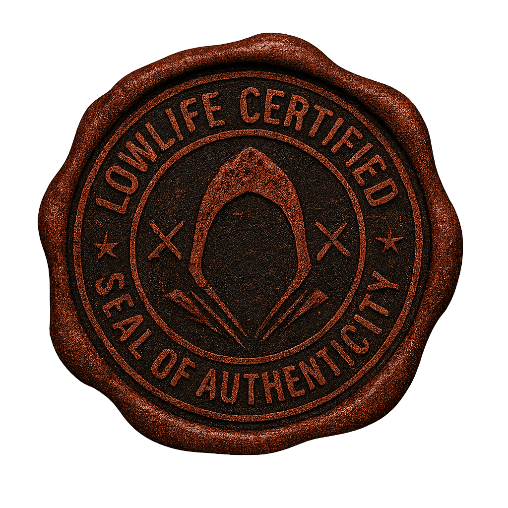
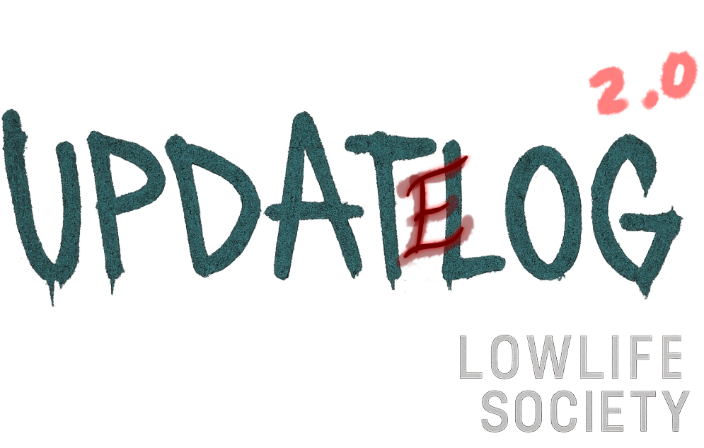

# Lowlife Society Changelog

## v0.8 — Embed Media & Watcher Polish (2025-08-18)

- **Embed Media Support**
  - Top-right **seal thumbnail** now auto-attaches if available.
  - Bottom **footer image** now auto-attaches if available.
  - Supports `.env` overrides:
    - `UPDATES_SEAL_PATH`
    - `UPDATES_FOOTER_PATH`

- **Watcher Improvements**
  - Automatic detection of changelog edits (`CHANGELOG.md`).
  - Prevents duplicate postings from multiple runs.
  - Logs now include trigger + posted update info.

- **Structural Changes**
  - `_extract_media()` handles inline Markdown images:
    - `` → seal (thumbnail).
    - `` → footer (bottom image).
    - First generic image (if no tag) defaults to footer.
  - Fallback to `.env` for missing images.

- **Community Embed Layout**
  - Consistent header, description, fields.
  - Top-right seal for certification.
  - Bottom banner for atmosphere.

### Next Steps → v0.9
- Add per-section icons (combat, economy, world, etc.).
- Introduce inline update categories for clarity.
- Begin experiment with auto-thread creation for patch discussions.

---

## v0.8 – Certified Test Release
**Date:** 2025-08-18
**Summary:** First “certified” post using embedded seal + footer images to validate visual pipeline.

### Added
- Implemented auto-log system to streamline update posting.
- Refined combat embed visuals (top-left icon, top-right icon, footer banner).
- Expanded changelog formatting to support in-post imagery (seal + footer).
### Testing
- Using v0.8 as a controlled test for embedded assets.
- Condensed changelog formatting (only one blank line between categories).
- Verified image placement via attachments.
### Notes
- If this renders correctly, we’ll standardize the certified seal for future updates.

##
#   
# Lowlife Society — Updatelog v0.8

---

### 🛠 Improvements
- Implemented auto-log system to streamline update posting.  
- Adjusted duel system options (separated "Choke" / "Let Go" / "Push" logic).  
- Refined combat embed visuals: top-left icon, top-right icon, footer banner.  
- Expanded changelog formatting to support in-post imagery (certification seal + footer).  

---

### 🧪 Testing
- Using v0.8 as a controlled test for embedded assets.  
- Condensed changelog formatting (no extra blank lines except between categories).  
- Verified placement of images in markdown flow.  
- Watching for Discord compatibility in embeds/attachments.  

---

### 📌 Notes
This log is the **first “certified” release** with the new visual seal + footer system.  
If this post renders properly in Discord with both assets aligned, we’ll scale the process forward for v0.9 → 1.0.  

---

## v0.7 – Stability & Future Prep  
**Date:** 2025-08-20  
**Summary:** Stabilization of update loop and prepping systems for 1.0 roadmap.  
### Added  
- Error handling around update watcher to prevent crash on missing channels.  
- Persistent log tracking for dev reference.  
### Changed  
- Standardized all logs into compact format.  
- Refined combat command registration and sync flow.  
### Notes  
- Roadmap alignment for Lowlife 1.0 in progress.  

## v0.6 – Enemy Pool & Expansion  
**Date:** 2025-08-20  
**Summary:** Built foundation for scalable NPC/Enemy pools.  
### Added  
- Matrix of enemy templates (basic, unnamed, MMO-style).  
- Hooks for future randomized encounters.  
### Changed  
- Consolidated NPC creation flow for modular additions.  
### Notes  
- Enemy pool will expand in parallel with player combat testing.  

## v0.5 – Distance & Disengage  
**Date:** 2025-08-19  
**Summary:** Began work on distance-aware combat flow.  
### Added  
- Range states (Close/Near/Mid/Far).  
- Movement actions: Advance, Retreat, Sprint.  
- Concealment bar prototype for stealth disengage.  
### Changed  
- Integrated range checks into attack/escape logic.  
- Refactored duel actions to support range-dependent outcomes.  
### Notes  
- AI defender logic for distance combat planned in v0.6.  

## v0.4 – Combat Expansion  
**Date:** 2025-08-19  
**Summary:** Core combat loop expanded with grappling, choke, and disengage flows.  
### Added  
- Grapple, choke, and push combat options.  
- Conditional “Gouge” option when choked.  
- Early retreat/disengage logic with concealment bar stub.  
### Changed  
- Split “Choke/Control” and “Let Go/Gouge” into distinct actions.  
- Adjusted turn flow to restrict action choices when choking.  
### Notes  
- Disengage and concealment bar to be expanded in v0.5.  

## v0.3 – Structure & Automation  
**Date:** 2025-08-18  
**Summary:** First automated changelog cycle and structure baseline.  
### Added  
- Directory log and master structure tracker (“Master Structure Log”).  
- Automatic changelog watcher integration into Discord (/updates).  
- Embed template for combat HUD (icons + image slots).  
### Changed  
- Changelog cadence set to 4 changes for testing.  
- Iteration cycle set up for v0.1 → v0.2 → v0.3.  
### Notes  
- Will revert to 10-change cadence starting v0.5 onward.  

## v0.3 – Feature Testbed
**Date:** 2025-08-18  
**Summary:** Validated watcher flow with a trimmed 4-change cycle before expanding cadence.  

### Added
- Changelog embed template locked in as the **standard output** for updates.  
- New Discord embed areas defined (top-left icon, top-right icon, footer art).  

### Changed
- Update cadence shifted to **4 changes per version** for testing stability.  

### Notes
- This cycle is the **validation run** — if the watcher posts cleanly, cadence reverts to **10 changes starting v0.4**.  

## vX.Y – <Codename or short title>
**Date:** YYYY-MM-DD
**Summary:** <1–2 line summary of what changed this version.>

### Added
- <New features or commands>
- <New UI/embeds/hooks>

### Changed
- <Behavior tweaks / refactors / perf improvements>

### Fixed
- <Bugs fixed with short, user-facing phrasing>

### Removed
- <Features deprecated/removed> *(optional)*

### Notes
- <Rollout notes, migration tips, known issues, or cadence info>

## v0.2 – System Iteration
**Date:** 2025-08-18
**Summary:** Expanded combat loop and structure polish during early testing.

### Added
- Defined cover, embed icon slots, and combat HUD template.
- Early structure log + directory documentation to keep systems aligned.
- Changelog watcher hooked and verified via Discord (/updates channel).
- Initial automated posting cycle confirmed with v0.1 → v0.2 testbed plan.

### Notes
- This cycle will run on a **4-change cadence** for testing update flow.
- Plan to revert to **10-change cadence** starting v0.3 onward.

## v0.1 – Initial Boot
...
